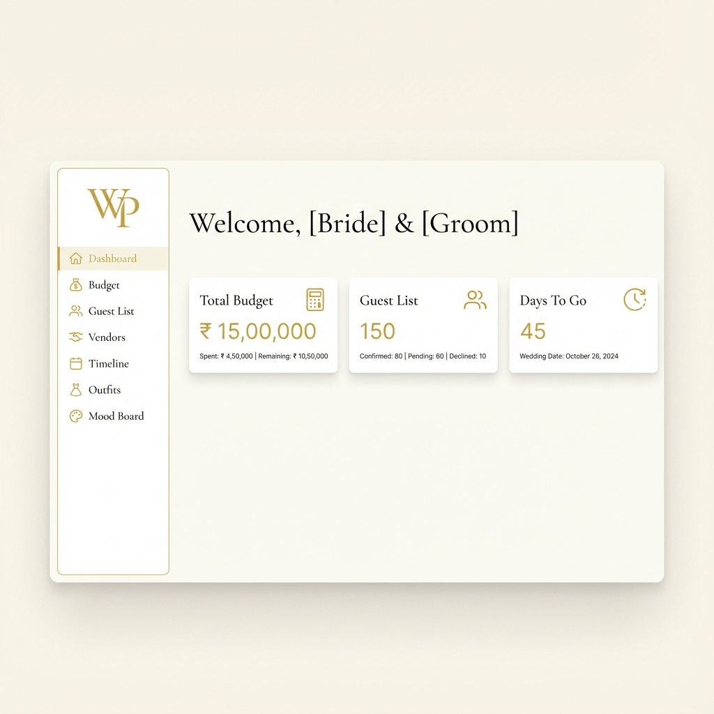
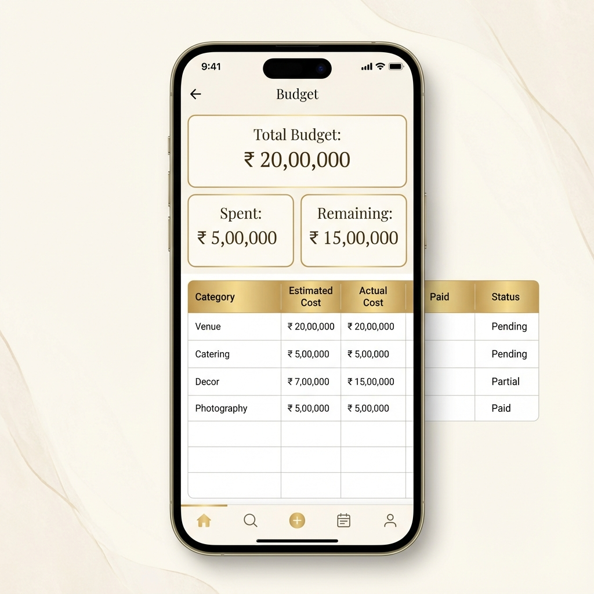
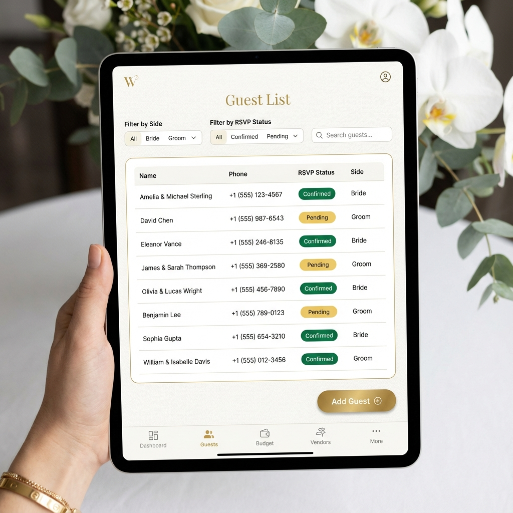

# Digital Wedding Planner (UI/UX)

A premium, luxury-grade Digital Wedding Planner application designed for Indian weddings. Built with **Next.js 14**, **Tailwind CSS**, and **Framer Motion**, focusing on emotional aesthetics, seamless interactions, and offline-first functionality.


<div align="center">
  
</div>

<div align="center">
  
  
</div>


## 🌟 Features

### Core Planning Tools
- **💰 Budget Tracker:** Real-time budget estimation vs. actual spend with variance calculation.
- **👥 Guest List Manager:** Track invitations, RSVPs (with vegetable/non-veg breakdown), and sides (Bride/Groom).
- **📋 Wedding Timeline:** Phase-wise checklist (6 Months to The Big Day) with progress tracking.
- **🏪 Vendor Manager:** Manage vendors (Caterers, Photographers, etc.) and track payments (Paid vs. Pending).

### Visual & Creative
- **👗 Outfit & Jewelry Planner:** Details for every ceremony (Mehendi, Sangeet, Wedding) with jewelry checklists.
- **🎨 Mood Boards:** Pinterest-style masonry grid for visuals and inspiration.
- **⏳ Dashboard:** Live countdown timer and quick summary stats.

### Features
- **Offline Persistence:** All data is saved automatically to the browser's LocalStorage.
- **Printable Mode:** Dedicated clear, ink-friendly layout for exporting the plan as a PDF.
- **Premium UI:** Glassmorphism, soft animations, and a curated "Wedding Ivory & Gold" color palette.

## 🛠️ Tech Stack

- **Framework:** [Next.js 14](https://nextjs.org/) (App Router)
- **Styling:** [Tailwind CSS](https://tailwindcss.com/)
- **Animations:** [Framer Motion](https://www.framer.com/motion/)
- **Icons:** [Lucide React](https://lucide.dev/)
- **Language:** TypeScript
- **Font:** Cormorant Garamond (Serif) & Inter (Sans)

## 🚀 Deployment

### Deploy on Vercel

The easiest way to deploy your Next.js app is to use the [Vercel Platform](https://vercel.com/new?utm_medium=default-template&filter=next.js&utm_source=create-next-app&utm_campaign=create-next-app-readme).

1. Push this repository to GitHub.
2. Login to Vercel and click "Add New...".
3. Select "Project" and import your GitHub repository.
4. Vercel will automatically detect the build settings. Click **Deploy**.


## 🚀 Getting Started

First, run the development server:

```bash
npm run dev
# or
yarn dev
# or
pnpm dev
# or
bun dev
```

Open [http://localhost:3000](http://localhost:3000) with your browser to see the result.

## 📂 Project Structure

```
├── app/                  # Next.js App Router pages
│   ├── budget/           # Budget Tracker
│   ├── guests/           # Guest List
│   ├── moodboard/        # Mood Boards
│   ├── outfits/          # Outfit Planner
│   ├── print/            # Printable View
│   ├── timeline/         # Task Timeline
│   ├── vendors/          # Vendor Manager
│   └── page.tsx          # Dashboard Home
├── components/           # Reusable UI components
│   ├── ui/               # Base elements (Button, Card, Input)
│   └── [feature]/        # Feature-specific components
├── hooks/                # Custom React hooks (Data persistence)
└── lib/                  # Utilities
```

## 🎨 Design System

The project uses a custom Tailwind theme defined in `tailwind.config.ts`:

- **Primary:** `wedding-gold` (#D4AF37)
- **Secondary:** `wedding-blush` (#FAE8E0)
- **Text:** `wedding-slate` (#333333)
- **Accent:** `wedding-maroon` (#800020)

## 📄 License

This project is open source and available under the [MIT License](LICENSE).
